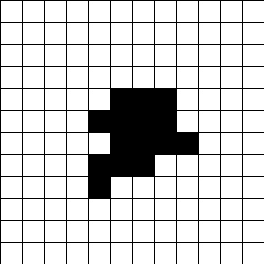
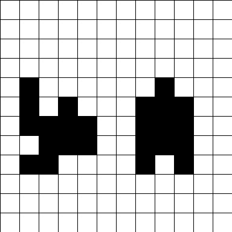
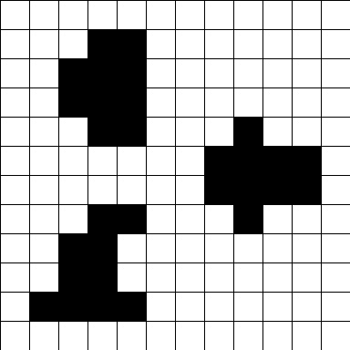
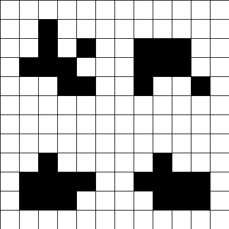
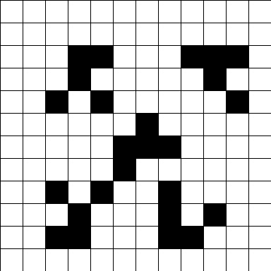

# Hide and seek

  This repo is a fork of [hide and seek](https://github.com/tehelka-gamedev/hide_and_seek).
  In its essence, we have focused our efforts on improving the different points that were listed
  at the end of the README.md of the original repo. Please feel free to consult it to see what was done there.

  As a remainder, this repo contains AI agents trained using the **Deep Q Network** model from the stable baseline 3 library (see [DQN](https://stable-baselines3.readthedocs.io/en/master/modules/dqn.html)).

  The Deep Q-Network algorithm merges traditionnal reiforcement learning with deep neural network, using the latter to approximate the Q-value function. In Q-learning, the policy is derived from the Q-value function by selecting the action that corresponds to the highest Q-value for the current state. In other words, the Q-value function provides the agent with the information necessary to choose the best action for each state.

  In our context, each agent is trained to hide from a player which holds still on maps of different architectures (see below).

## Improvements from the original repo

  In this section, we present what was done starting from the original repository.

1. Format
    * The tree architecture of the original repo was flat. We have re-organised the code into modules making the codebase much clearer.
    * In the original repo, the code was not PEP compliant. We have focused our efforts on making it (almost) PEP compliant. The code is now more readable.
    * The command line interfaces of the different functions were inside their bodies. Arguments of the main functions were not listed correctly into their definitions. Subprocesses were used to call a given function. This was not very handy and should be considered as a bad practice, we have completely re-organised the code making the definitions of functions more explicit and avoiding calling subprocesses.
2. Training
    * The agents trained from the original repo were not able to generalize correctly to maps they didn't see during their training. We have implemented a mechanism to expose the agents to randomly generated maps of different architectures (see below). Our trained agents can now hide much efficiently on maps they didn't see during their training.
    * *Note*: the original repo proposed 3 different types of Observation. This represents the amount of the environment the agent can "see" during training. The BasicObservation and ImmediateSurroundingsObservation turned out to exhibit poor performances. We have dropped them and kept only the LongViewObservation (see [hide and seek](https://github.com/tehelka-gamedev/hide_and_seek) for more informations).
    * The Game.Game.generate_random_map() method of the original repo was useless. The generated maps were not well structured to teach anything usefull to the agents. We have completely re-implemented this method. The agent can now learn correctly on random maps.
    * We have fixed the seed of models during training and evaluation. Evaluations of models are now fully reproducible making their comparison easier.
    * We have increased the dimensionality of the hyperparameters search space for the grid search.


# Installation

We assume at least a python3.10 or higher installation.
If not present by default on your system, you can create an anaconda/miniconda virtual environment (see [installation instructions](https://docs.anaconda.com/free/anaconda/install/linux/)):

```bash
# Optionnal
conda create -n python3.10 python=3.10
conda activate python3.10
```

Once a 3.10 or higher version of python is in the PATH, follow these instructions to install the package into a virtual environment called .venv:

```bash
git clone https://github.com/ystoll/hide_and_seek
cd hide_and_seek
python -m venv .venv
source .venv/bin/activate
pip install -r requirements.txt
```

# Quick start

To see the best agent we trained escaping the player on the statement map for 20 episodes, simply run:

```bash
python start_game.py models/best_models/level4/DQN_TS_map_random_freq_4_step_level_4_lr_0.001_expl_0.01_explfrac_0.5_gamma_0.8_LongViewObservation_view_size_5/500000.zip
```

To see the agent play on randomly generated maps (one per episode), run:

```bash
python start_game.py models/best_models/level4/DQN_TS_map_random_freq_4_step_level_4_lr_0.001_expl_0.01_explfrac_0.5_gamma_0.8_LongViewObservation_view_size_5/500000.zip\
                        --game_map random \
                        --nb_episodes 20 \
                        --levels 4
```

***Note***: we provide a collection of scripts into the scripts/ folder. Feel free to have a look at them and tune them according to your needs.

# Game map generator

## Presentation

We have completely re-implemented the game map generator (see hidegame.game.Game.generate_random_map() method). The generator can now generate five types of maps:
  <table>
    <tr>
      <td>Level 1</td>
      <td>Level 2</td>
      <td>Level 3</td>
    </tr>
    <tr>
      <td></td>
      <td></td>
      <td></td>
    </tr>
    <tr>
      <td>Level 4</td>
      <td>Level 5</td>
    </tr>
    <tr>
      <td></td>
      <td></td>
    </tr>
  </table>

## Generating a map of a given level

To generate and display a map of level 3, run:

```bash
python hidegame/game.py --map random --level 3
```

This will display a random map of level 3 into a window. To close the window, press any key while the window is active.

# Training an agent.

To train an agent with default parameters, run:

```bash
python train.py --model_folder trained_agent \
        --timesteps 500000 \
        --train_map random \
        --levels 3
```

This will train an agent during 500_000 time steps on level 3 random maps.
The trained agent will be stored in models/trained_agent directory.


# Evaluating an agent

To evaluate an agent, run:

```bash
python evaluate.py  models/best_models/level4/DQN_TS_map_random_freq_4_step_level_4_lr_0.001_expl_0.01_explfrac_0.5_gamma_0.8_LongViewObservation_view_size_5/500000.zip \
           --eval_map random \
           --nb_episodes 1000 \
           --levels 4
```

This will print the mean reward evaluated on 1000 episodes played on random map of level 4.
Levels may also be a space separated list of levels.

For instance:

```bash
python evaluate.py  models/best_models/level4/DQN_TS_map_random_freq_4_step_level_4_lr_0.001_expl_0.01_explfrac_0.5_gamma_0.8_LongViewObservation_view_size_5/500000.zip \
           --eval_map random \
           --nb_episodes 1000 \
           --levels 3 5
```

will evaluate the agent on levels 3 and 5. 1000 episodes will be played per level. A per level evaluation as well as agregated results will be displayed.


# Training and evaluating a batch of agents.

All commands to train and evaluate a batch of agents are in the script/start_grid.sh script.
Code should be self explanatory.


# Results

In this section, we present the results we got from training.

## Mono level training

The best agent we trained on level 4 ("statement like") maps reached the following performances

|Map | Mean reward | Std reward |
| --- | --- | --- |
| Random,  Level 3 |  2.97 | 116.61 |
| Random,  Level 4 |  46.46 | 24.61 |
| Random,  Level 5 |  21.04 | 93.39 |
| Statement |  42.64 | 43.72 |

We can see that the distribution of rewards is much higher when we ealuate the agent only on the statement map.
This may be explained because as we trained the agent on a variety of randomly generated maps, it is a bit less performant on a fixed map.
Also, obviously, the performances are way worse when we evaluate this agent on levels 3 and 5 maps as it was not trained on these.


***Note: All our results can be reproduced using scripts/train.sh.***

## Multi levels training (preliminary)

We want to expose here our preliminary results concerning a multi levels training.
The idea is to find the "sweet spot" in the hyperparameters space that will allow our agent to be performant on maps of different levels.

**Note**: unfortunately our multi-levels grid search was interrupted due to a hardware crash.
These results should hence must be considered only as preliminary.

The best model we got so far reached the following performances:

|Map | Mean reward | Std reward |
| --- | --- | --- |
| Random,  Level 3 |  36.53 | 61.22 |
| Random,  Level 4 |  41.19 | 48.77 |
| Random,  Level 5 |  31.39 | 74.43 |
| Total |  36.37 | 36.00 |

Clearly, the agent perform well better on maps of levels 3 and 5. The training procedure was efficient.


# TODO list

We present here what should be done, according to our believes, in the future.
This list is presented by descending order of priority:

1. Formatting

  * First and foremost, a well structured test suit should be implemented. Once wrtten, a CI/CD pipeline should be inplace, using for instance Github actions,
  * The efforts to make the code more readable, PEP compliant, and performant should continue, as in coding **clarity and uniformity are importants**.
  * In this same spirit, certain portions of the code still need factorizations.

2. Training

  * The grid search we used was quite **naive**. More efficient approaches exist to tune the hyperparameter space. One can for instance use Bayesian approaches. The recommended library to use with Stable Baseline 3 seems to be [Optuna](https://optuna.org/).This should definitely be explored in the future.
  * Callbacks should be used during training to have more control over the training procedures ([callbacks](https://stable-baselines3.readthedocs.io/en/master/guide/callbacks.html)).
  * Double Q Networks might be interesting. Also not supported yet by the stable baseline library, an issue is open ([double q networks](https://github.com/DLR-RM/stable-baselines3/issues/622)) hoping for future integration (see also this [notebook](https://colab.research.google.com/github/Stable-Baselines-Team/rl-colab-notebooks/blob/sb3/dqn_sb3.ipynb)).
  * There is still room for improving our random map generator. For instance, this method works well only with 12x12 maps.


